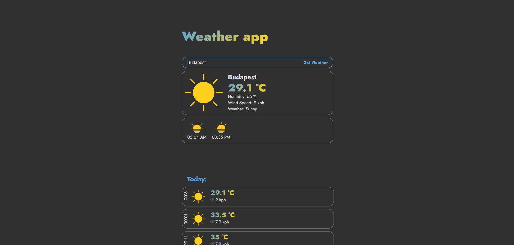

# Weather App

This Weather App provides current weather information and a 3-day forecast for a specified city or the user's current location. The app utilizes the WeatherAPI.com service to fetch weather data.


Demo: [Weather App](https://www.damdev.xyz/Content/weather/)

## Features

- **Current Weather**: Displays the current temperature, humidity, wind speed, and weather conditions for the specified location.
- **3-Day Forecast**: Shows hourly weather data for the current day, tomorrow, and the day after tomorrow.
- **Geolocation Support**: Automatically fetches weather data based on the user's current location if geolocation is enabled in the browser.
- **Search by City**: Users can enter a city name to get the weather information for that location.

## Technologies Used

- **Frontend**: HTML, CSS, JavaScript
- **Backend**: PHP
- **Weather Data**: [WeatherAPI.com](https://www.weatherapi.com/)

## Setup Instructions

### Prerequisites

- A web server with PHP support (e.g., Apache, Nginx)
- An API key from [WeatherAPI.com](https://www.weatherapi.com/)

### Installation

1. **Clone the repository**:

    ```bash
    git clone https://github.com/DAM001/weatherApp.git
    cd weather-app
    ```

2. **Set up the PHP script**:

    - Create a file named `weather.php` in the `server` directory of your project and add the following code:

        ```php
        <?php
        if (isset($_GET['city']) || (isset($_GET['lat']) && isset($_GET['lon']))) {
            $apiKey = 'YOUR_API_KEY'; // Replace with your actual API key
            $baseUrl = 'https://api.weatherapi.com/v1/forecast.json?key=' . $apiKey . '&days=3';

            if (isset($_GET['city'])) {
                $city = urlencode($_GET['city']);
                $url = $baseUrl . '&q=' . $city;
            } else {
                $lat = $_GET['lat'];
                $lon = $_GET['lon'];
                $url = $baseUrl . '&q=' . $lat . ',' . $lon;
            }

            $response = file_get_contents($url);
            echo $response;
        } else {
            echo json_encode(['error' => 'No location provided']);
        }
        ?>
        ```

    - Replace `YOUR_API_KEY` with your actual API key from WeatherAPI.com.

3. **Set up the frontend**:

    - Ensure your HTML, CSS, and JavaScript files are correctly placed in your project directory.

### Usage

1. **Open the application in your browser**:
    - Navigate to the directory where you set up the project and open the `index.html` file in your web browser.

2. **Get weather information**:
    - Enter a city name in the search bar and click the "Search" button to fetch weather data for that city.
    - If geolocation is enabled in your browser, the app will automatically fetch and display weather information for your current location.

## File Structure

```plaintext
weather-app/
├── index.html
├── style.css
├── script.js
├── server/
│   └── weather.php
├── assets/
│   ├── cloud.png
│   ├── fog.png
│   ├── wind.png
│   └── ...other assets
```

## License

This project is licensed under the MIT License. See the [LICENSE](LICENSE) file for details.

## Acknowledgements

- [WeatherAPI.com](https://www.weatherapi.com/) for providing the weather data.